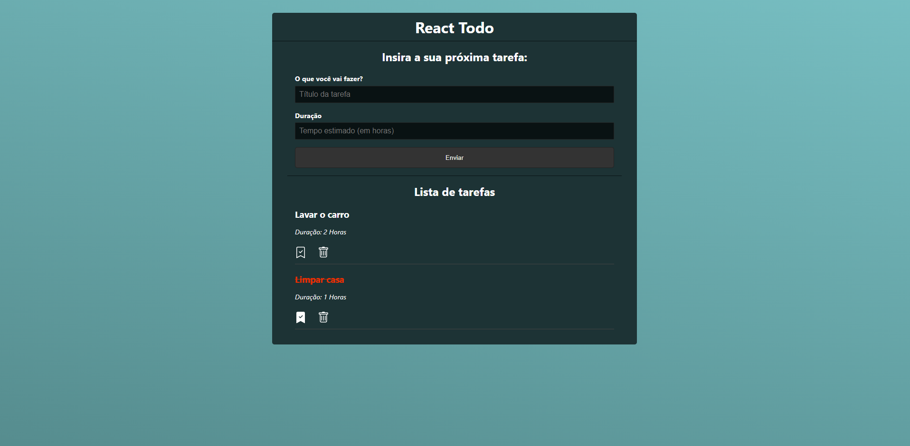

# React App Todo List

Para executar o projeto siga os seguintes passos.

Execute os seguintes comandos.
### 1º `npm install`

### 2º `npm run server`

### 3º `npm run start`

Tudo ok, sua aplicação estara em execução!

<hr>

Package.json (necessitar tere esse comando)

```
"scripts": {
    "start": "react-scripts start",
    "server": "json-server --watch data/db.json --port 5000"
  },
```

## Base de dados

Para base de dados sera usado a lib `json-server` que sera executada em `http://localhost:5000`

<hr>

